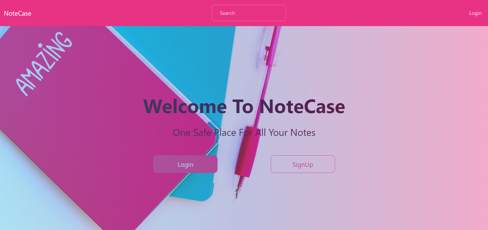
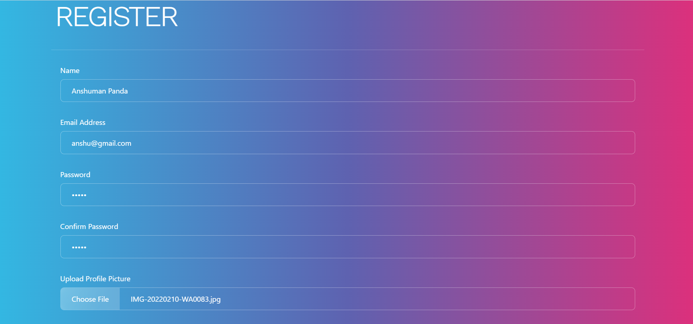
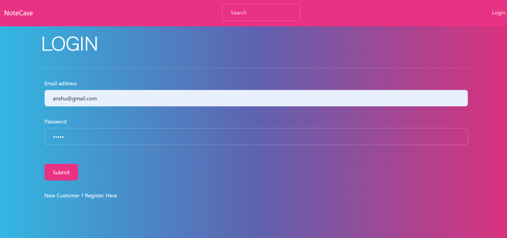
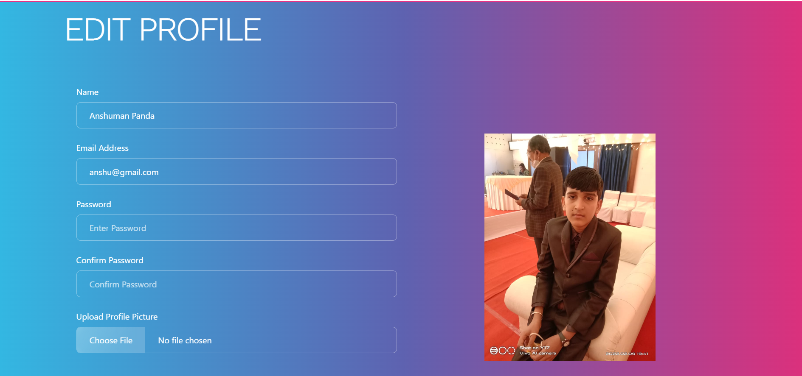
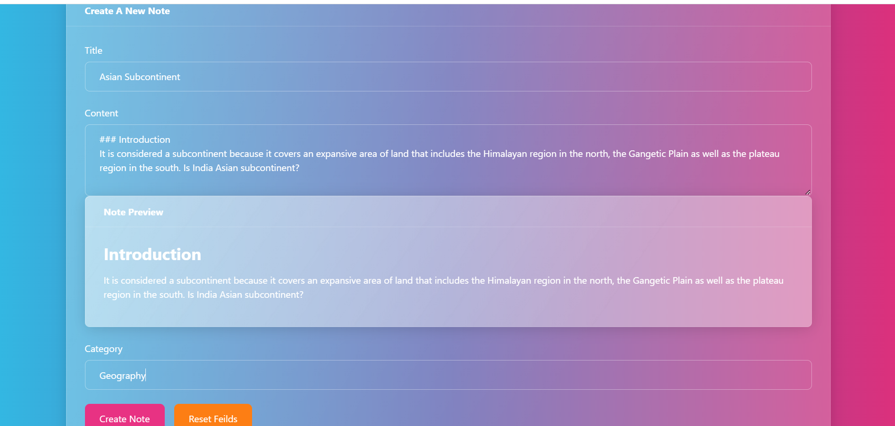
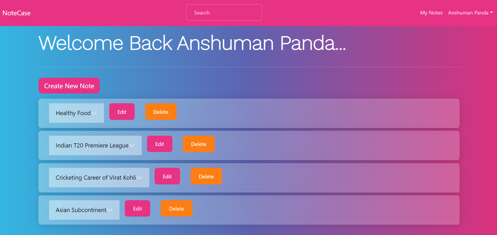
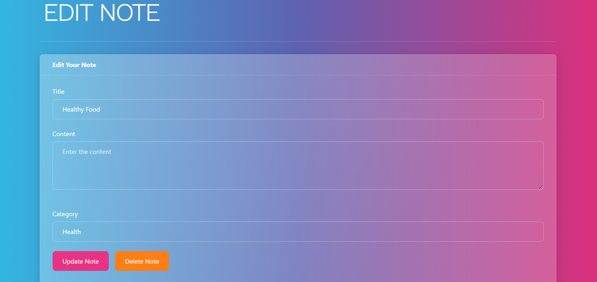
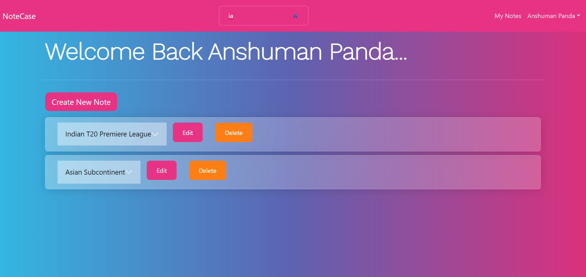

# Notecase

Notecase is a Full Stack MERN note-making application that helps users 
to write and save their notes and can later refer them easily.

Notecase basically reflects the usage of CRUD applications.


## Tech Stack

**Client:** React, Redux, React Bootstrap

**Server:** Node JS, Express JS

**Database:** Mongo DB


## Demo

**The deployed chat application link:**

https://notecase-mern.herokuapp.com/



## Run Locally

**Clone the project**

```bash
  git clone https://github.com/Hara0706/Notecase
```

**Go to the project directory**

```bash
  cd Notecase
```

**Install dependencies**

```bash
  npm install
```
```bash
  cd frontend/
  npm install
```

**Start the server**

```bash
  npm run start
```


## Features

**Authentication**

- The Register feature is used for registering a new user by entering 
  his/her details.



- The Login feature is used by an already registered user to sign in
  into the application.
- The logout functionality is also provided.



- Profile details can also be accessed by the user 
- They can even edit their profile.



**Creating Notes**

- Users can create their own notes reviewing with Note Preview.
- Title, Content and Category provided to each note.



- User can view and access all his/her notes in a list.
- Notes are in the order of their creation.



- The notes can even be updated or deleted.



- Searching for the notes is easier.




## Author

- [@Hara0706](https://www.github.com/Hara0706)

